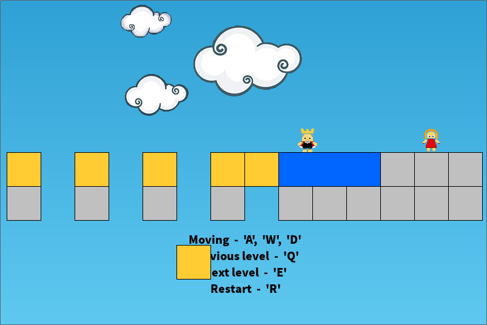

# Midas

Midas is a simple 2D-platformer game, written on C language using based on one Greek legend.



### The backstory
Midas was a Phrygian king who was renowned for his great fortune. Legend has it that in reward for a good deed Midas asked Dionysus a gift. That gift was to make everything he touches to become gold. Soon enough the king nearly starve (due to the fact that the food become gold). In order to get rid of the unfortune sorcery Dionis told Midas to take a bath in saint waters. This is what you are going to do.

### Dependencies
This game requires [SDL2](https://www.libsdl.org) and [SDL2_image](https://www.libsdl.org/projects/SDL_image/) installed

In Ubuntu the following should be enough:
```sh
$ sudo apt-get install libsdl2-dev
$ sudo apt-get install libsdl2-image-dev
```

### Usage
That would build and run the game:
```sh
$ make clean
$ make
$ ./midas
```
